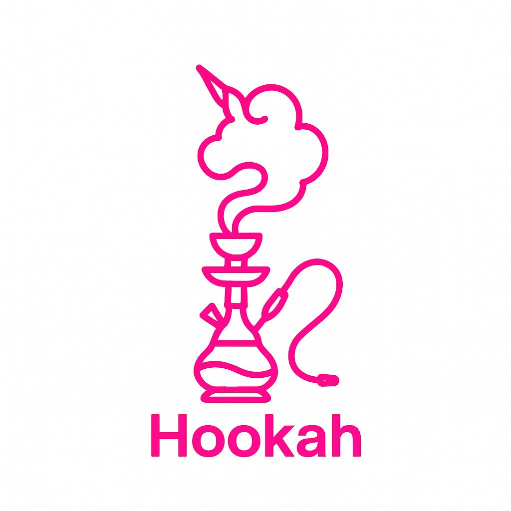
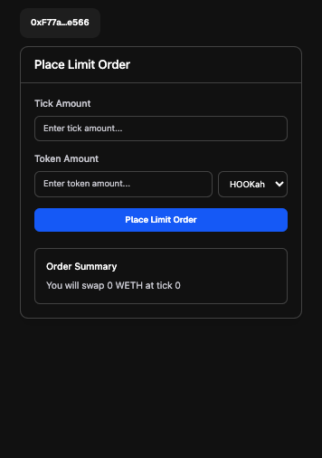

# 💨 Order Hookah 🧞‍♂️  
**Uniswap v4 Hook + Farcaster Miniapp on Base**




## 🧠 What Problem Does It Solve?

**Order Hookah** bridges the gap between traditional finance and decentralized trading by delivering the **intuitive experience of a centralized exchange (CEX)** while preserving the **security and transparency of DeFi**.

By leveraging **Uniswap v4 hooks**, the protocol enables:
- Advanced limit orders that behave like those in traditional markets.
- Tokenized access to real-world assets via Hookah tokens.
- Seamless user onboarding with streamlined KYC flows.

This makes it possible for everyday users to engage in **precision trading**, comply with **regulatory requirements**, and interact with tokenized RWAs—**all from within a decentralized Farcaster miniapp.**

---

## ✨ Key Features

- 🔁 **Advanced Limit Orders**  
  Set exact entry and exit prices using custom Uniswap v4 hooks.

- 🌍 **Tokenized Real-World Assets**  
  Trade Hookah tokens backed by real-world assets directly on-chain.

- 🧾 **Streamlined KYC Integration**  
  Optional KYC hooks help meet compliance needs without undermining DeFi principles.

- 📱 **Miniapp Experience**  
  Built with [MiniKit](https://docs.farcaster.xyz/developers/minikits/intro) for a seamless, gas-efficient, and mobile-first interface right inside Warpcast.

---

## 🚀 How It Works

1. **The user opens Order Hookah** on Farcaster (via Frames).
2. **They place a limit order** (e.g., Buy ETH at 2900).
3. The custom **Uniswap v4 Hook** holds the order securely.
4. When market conditions match the user’s price:
   - A swap is triggered.
   - The user earns their target asset.
5. Users can **claim profits** or **view active orders** in-app.

All transactions are non-custodial, gas-efficient, and user-friendly—right from social feeds.

---

## 🌐 Tech Stack

| Layer         | Tech                                   |
|---------------|----------------------------------------|
| Protocol      | Uniswap v4 Hooks (Limit Order + KYC)  |
| Assets        | Hookah Tokens (RWAs)                   |
| Frontend      | Farcaster Miniapp via MiniKit          |
| Wallet        | Coinbase Wallet SDK                    |
| Chain         | 🟦 Base (L2) - Fast & Cheap             |

---

## 🛠 Setup Instructions

### 🔧 Contracts

> Requires [Foundry](https://book.getfoundry.sh/)

```bash
forge install
forge build
forge test -vvvv --via-ir
```

## 🌐 Frontend (Farcaster Miniapp)

> Requires bun or npm and access to Warpcast Developer tools

```bash
bun install
bun run dev
```

## 📁 Project Structure

```bash
/contracts/src/TakeProfitHook.sol        - The Uniswap v4 Hook logic
/contracts/src/KYCRegistry.sol           - Tracks user orders
/order-hook-ah/                          - Farcaster MiniApp (MiniKit + Coinbase SDK)
/script/DeployTakeProfitsHook.sol        - Deployment script for the hook
/assets/                                 - UX mocks
```


---

## 📸 UX Preview  



*Simple, mobile-first limit order flow inside Warpcast.*

---

## 🤝 Integrations

- [Uniswap v4 Core](https://github.com/uniswap/v4-core)
- [v4 Periphery](https://github.com/uniswap/v4-periphery)
- [MiniKit (Farcaster Dev)](https://docs.farcaster.xyz/developers/minikits/intro)
- [Coinbase Developer Kit](https://docs.wallet.coinbase.com/wallet-sdk/overview)
- [Base Docs](https://docs.base.org/)

---

## 🌍 Deployed On

- **Base L2 (Sepolia Base)** – Contracts deployed  
<!-- - **Farcaster Frame** – Live miniapp inside Warpcast   -->
- **Frontend** – Integrated with Coinbase Wallet  

> More deployment details coming soon in `/deployments/` folder.

---

## 🔗 Links & Resources

- [Uniswap v4 Docs](https://docs.uniswap.org/contracts/v4/overview)
- [Uniswap v4 by Example](https://v4-by-example.org/)
- [Farcaster Developer Docs](https://docs.farcaster.xyz/)
- [Coinbase Wallet SDK](https://docs.wallet.coinbase.com/wallet-sdk/overview)
- [Base Documentation](https://docs.base.org/)

---

**Built with love at Base Batch Hackathon**  
*Hook smarter, not harder.*
